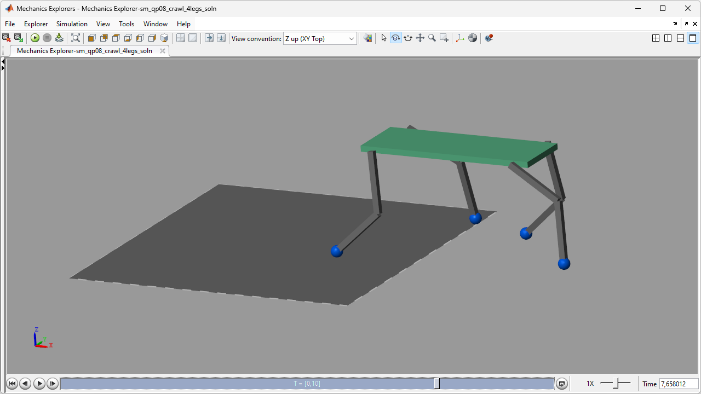
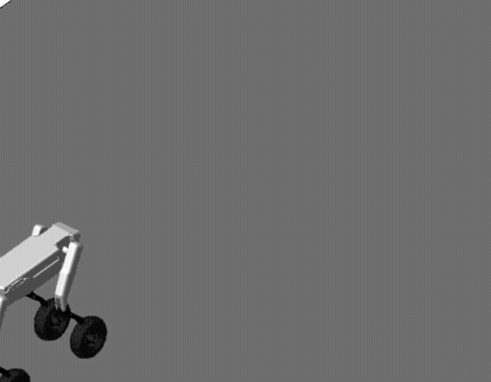
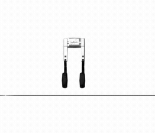
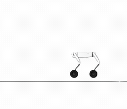
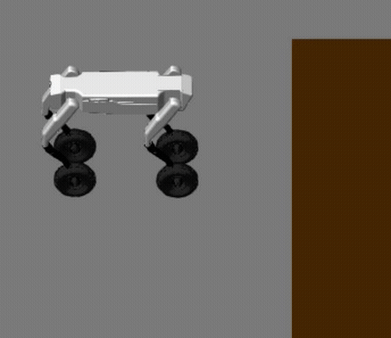

# **Wheeled Quadruped Robot Concept Design in Simscape&trade;**
This is the repository for the Software Lab project in 2025!

## **Engineers and Authors**
1. Hongyu Jiang
2. Anurag R Nair
3. Nikil Magesh

## **Coaches**
1. Andreas Apostolatos
1. Jan Janse van Rensburg
1. Steve Miller

## **Goals For Project**
1. To develop a design for a Wheeled Quadruped Rescue Robot
2. Should be able to have a payload capacity and be able to carry deliverables in hard to reach areas

## **Objectives of the Robot**
1. Autonomous Operation
2. Environmental Sensing
3. Payload Delivery
4. Surveillance
5. Mobility

## **Robot Visualization**
<!--  -->

## **Path Planning**
While the Pure-Pursuit controller is responsible for tracking a given reference 
trajectory, it does not generate the trajectory itself. Therefore, a dedicated
path-planning algorithm is essential for computing an optimal, collision-free path 
from a start to a target within the environment. 

### **Environment Representation and Map Scaling**
The environment is represented using a **2D occupancy grid**, 
discretised into uniformly sized square cells. Each cell represents a 
region of physical space and is classified as either **free** or **occupied**.

To improve spatial resolution without altering the physical layout, the map 
is scaled by a factor of 3, resulting in a **300×300** grid. This increases 
obstacle definition and path smoothness at the cost of higher computational 
effort.

The obstacle regions are defined analytically using **rectangular and circular
primitives** and rasterised into the grid through logical occupancy tests. Cell
semantics are defined as:

- **Free Space:** Traversable cells.
- **Obstacles:** Non-traversable cells.
- **Start and goal:** explicitly enforced as free cells.

To ensure collision-free motion, and taking into account the physical footprint 
of the robot, obstacle inflation is applied by introducing a safety margin 
around occupied cells. 

This grid-based representation provides a structured search space that is 
well-suited for graph-based planners such as A*, enabling efficient computation 
of collision-free paths for integration with waypoint-following controllers.

### **A-star Algorithm**
Path planning is performed using the A* algorithm, which extends the Dijkstra 
algorithm by incorporating a heuristic function to guide the search toward 
the goal. The A* algorithm is employed to compute an optimal collision-free 
path between the predefined start and goal on the discretized grid map.

At each node $n$, the total cost is defined as:\
    $f(n) = g(n) + h(n)$

where:
- $g(n)$ is the accumulated path cost from the start, and
- $h(n)$ is the heuristic estimate to the goal, chosen here as the **Euclidean
distance**, derived as below:\
    $h(n) = \sqrt{(x_n - x_{goal})^2 + (y_n - y_{goal})^2}$

### **Search Strategy and Data Structures**

The algorithm maintains two primary data structures:

- The **CLOSED list** is pre-populated with all obstacle cells, 
    preventing their expansion during the search.
- The **OPEN list** initially only contains the start node, 
    for which the accumulated cost $g(n)$, heuristic cost $h(n)$, and 
    total cost $f(n)$ are computed.

Obstacle cells are excluded from expansion, and each successor node is only
updated if a **lower-cost path** is discovered. This guarantee that the final
solution is optimal under an admissible heuristic.

Search terminates when the goal node is selected for expansion or when no
feasible path exists.

### **Path Termination and Reconstruction**

Once the goal is reached, the optimal path is reconstructed by **backtracking
through stored parent pointers**, generating an ordered sequence of grid coordinates
from start to goal. This sequence is then converted into waypoints suitable for
downstream use by the Pure-Pursuit controller. A final validation step ensures
that no reconstructed path point intersects an obstacle cell.

## **Control & Modeling logic**

The system architecture is divided into two distinct locomotion modes, toggled by a high-level state machine. 
The gait of the wheel-mode and leg-mode are sperately built in Simscape Multibody.

### 1. Wheel Mode (Driving)
Designed for high-speed navigation on flat terrain.
* **Mechanism:** Implements a **"Soft-lock"** strategy where Hip and Knee joints maintain high stiffness to act as a rigid chassis.
* **Control:** Uses **Pure Pursuit Algorithm** to calculate steering angles and differential wheel velocities based on the planned path.

The Joints felxibility can be controlled by input a cmd to the **Soft-lock** block, so that the robot can squad or stand up while driving.

   
   
  <em>Figure 1: Wheel-mode pure-pursuit demonstration.</em>

| **Steering** | **Squad** |
| :---: | :---: |
|  |  |

### 2. Leg Mode (Walking)
Designed for obstacle negotiation and complex terrain.
* **Mechanism:** Joints are unlocked, and the system switches to **Closed-loop Torque Control**.
* **Core Challenge:** Tch critical stability issue occurs during the **Rear_Leg-Lifting Phase**.
  Without active Center of Mass (CoM) compensation, the reduction of the support polygon can lead to static instability.

| **Walking_Back** | **Walking_Left** |
| :---: | :---: |
|  |  |

### Current Limitation: Stair Climbing Instability

While the system validates the kinematic feasibility of climbing, it currently faces stability challenges
during full obstacle traversal:

* **Front Legs (Success):** The robot can successfully lift and place its front legs onto a step, though the motion currently exhibits some oscillation ("bumpy" transition).
* **Rear Legs (Failure):** The system fails during the **Rear-Leg Lifting Phase**.
  * **Reason:** As shown in the failure cases, lifting a rear leg significantly reduces the **Support Polygon**. Without active CoM shifting or ZMP feedback, the robot loses static balance and tips over.
  * **Future Work:** Plan to implement a closed loop balance controller with IMU feedback to adjust the CoM before lifting rear legs.

   
   
  <em>Climbing front leg lifting.</em>

